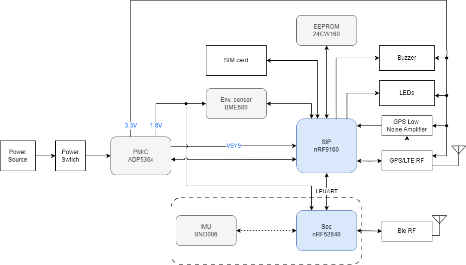
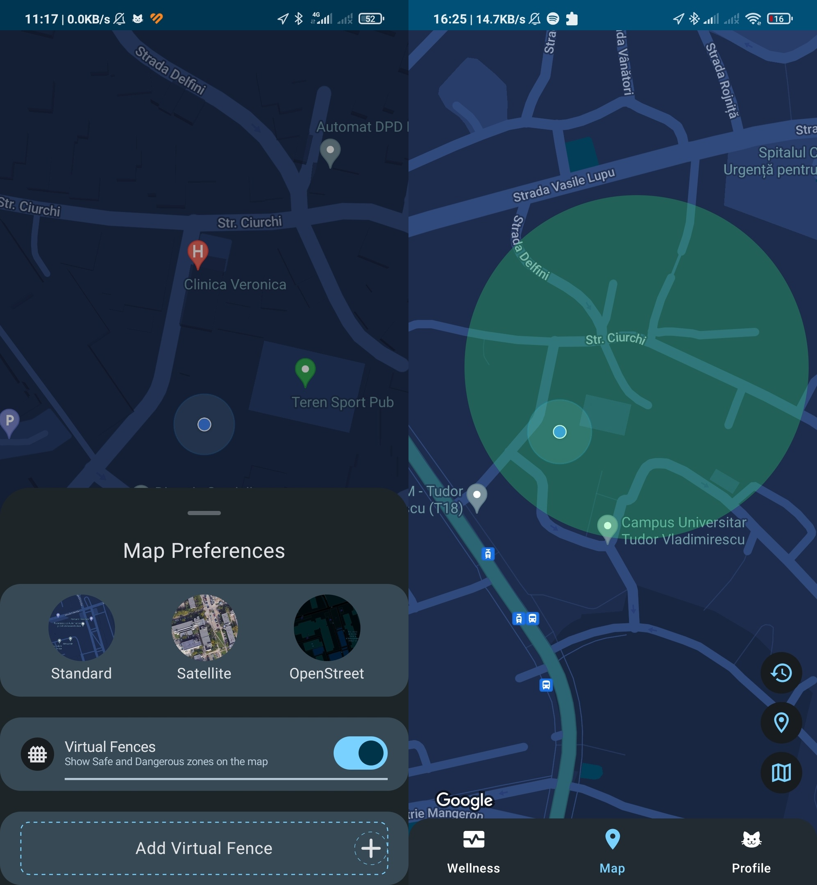
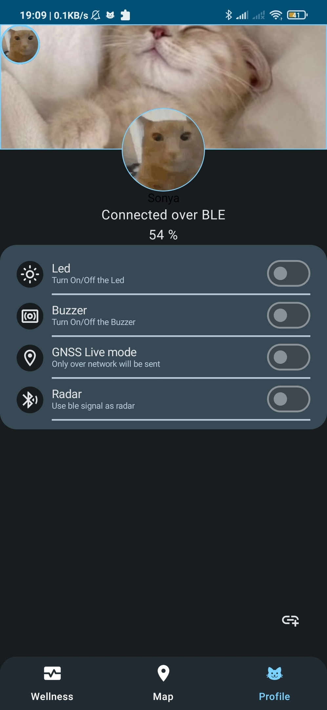
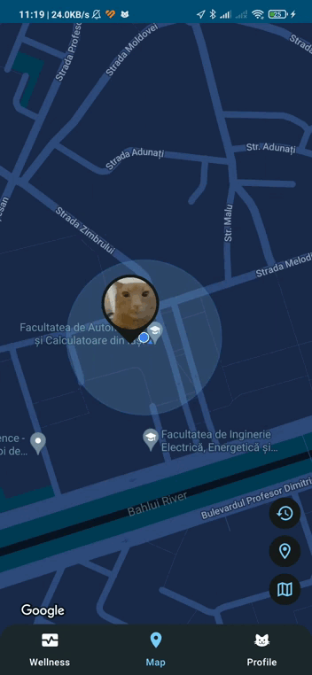
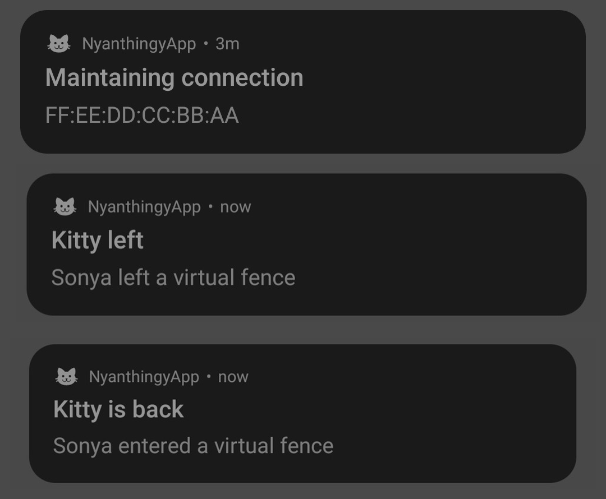
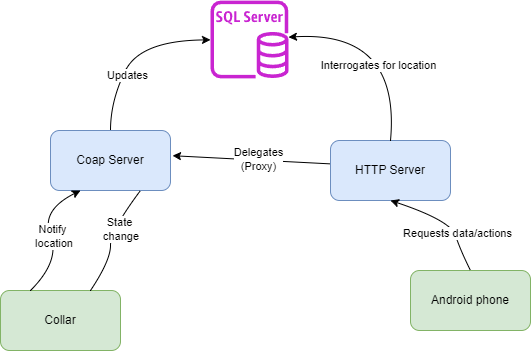

## About

A prototype of a smart collar similar to tractive, consisting of a hardware, mobile and server components.
Some brief ideas about the project:

- The hardware component, the collar itself, is based on Thingy91 paired with BNO086.
- The firmware is written using [nRF Connect SDK](https://www.nordicsemi.com/Products/Development-software/nRF-Connect-SDK).
- To enhance battery life it uses CoAP and Bluetooth low energy as external communication protocols and LPUART for inter-chip.

- The mobile component is an Android native app built with [Jetpack Compose](https://developer.android.com/compose).
Example of app usage:

  

  
  

- The server component act as a proxy between the two when those are not in close proximity, translating the CoAP request to HTTP.

